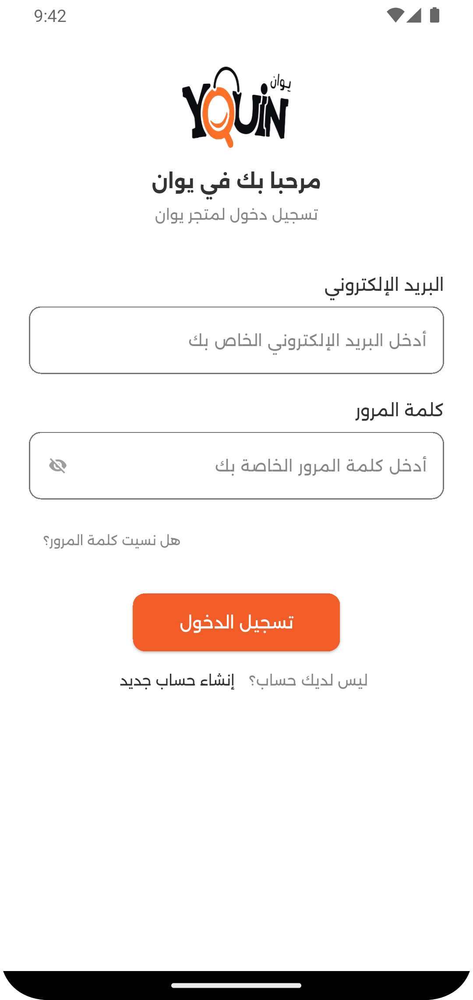
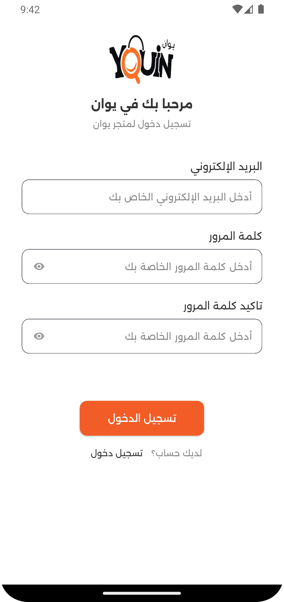
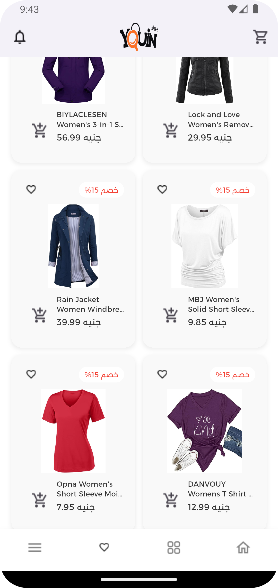

# guessit_task

Flutter Task in simple store app

## 📸 Screenshots

📌 Technologies Used in the Project:
Flutter - The main framework for the application.
Dart - The programming language used with Flutter.
SQLite - For storing user data locally and managing login operations.
Carousel Slider - For displaying an image slider on the home page.
Material Design - For UI design following Google’s guidelines.
API Integration (upcoming) - Planned for implementation after completing the design.

